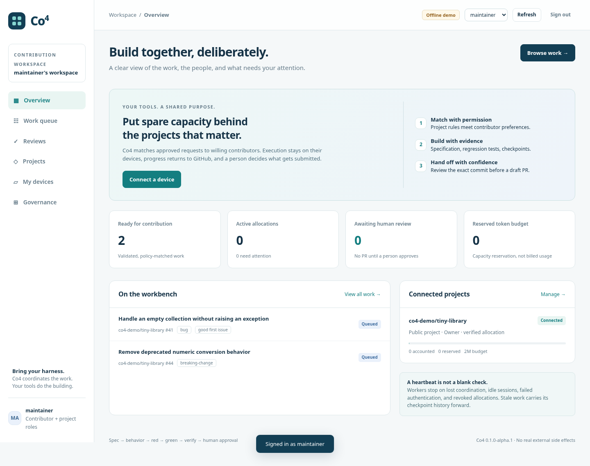

# Co4

**Code. Collaboration. Cooperation. Computation.**

A GitHub-first contribution coordinator that connects project rules, willing contributors, and their existing coding tools. Co4 allocates work and governs publication. It is not a coding harness, a model proxy, or a payment processor.

**Release: 0.1.0-alpha.2.** Runnable control plane, contributor worker, offline end-to-end walkthrough, and Claude Code / Codex CLI / GitHub Copilot CLI adapters. The deterministic demo is tested with real Git commits and real regression tests. Native interactive terminal execution is optional for all three adapters; the new example config selects it. The adapters have command-contract, real-PTY fixture workflow, and telemetry-parser tests, but authenticated model runs and live GitHub installation have **not** been performed for this release. Read [the test report](docs/testing.md) before enabling live work.



## Run the complete local walkthrough

Requires Python 3.11+ and Git. Python 3.13 on Linux was used for release verification. WSL is the recommended initial Windows worker environment; native Windows process handling exists but was not exercised here.

```bash
python -m venv .venv
source .venv/bin/activate
python -m pip install .
co4 demo
```

PowerShell activation, when using native Python:

```powershell
.\.venv\Scripts\Activate.ps1
```

Open **http://localhost:8080**. Explore as maintainer. The demo is loopback-only and uses three conspicuously labeled fixture identities. It does not contact GitHub, call a model, spend money, or create a real PR.

In another terminal, activate the same environment and run:

```bash
co4 demo-worker
```

Switch the web app to **contributor**, open **Reviews**, inspect the full diff, receipt, and private trace, affirm the review checkbox, and approve the commit. The dispatcher records a simulated draft submission. You will see the baseline test pass, an added empty-input test fail with `ZeroDivisionError`, and the implementation pass both verification runs. The worker stops at review until a human acts.

For an occupied port:

```bash
co4 demo --port 8765 --database sqlite:///./co4-demo-8765.db
co4 demo-worker --server http://localhost:8765
```

The fixture exercises issue #41, not arbitrary issue solving. To repeat from a clean slate, stop the server and use a new database path. Never deploy demo identities or the demo encryption key on a public service.

## What ships

| Area | Implemented in this alpha |
|---|---|
| Project governance | GitHub App enrollment, GitHub sign-in, repository-scoped owner/maintainer/triager/contributor/suspended roles, verification, validation, label rules, watching, quotas, policy audit |
| Intake | Signed GitHub webhooks, replay deduplication, open-issue import, issue edits/closure and installation revocation cancellation |
| Allocation | Durable leases, atomic reservation, per-user concurrency limit, device autonomy, accept/decline/pause/revoke, local repository allowlist, FIFO or priority-plus-age |
| Execution | Claude Code, Codex CLI, Copilot CLI adapters; persisted worker state; exposed prompts/output/events; heartbeat and subprocess watchdog; early and periodic Git checkpoints |
| Delivery discipline | Passing baseline, written specification and Gherkin scenarios, failing regression test, passing implementation, unchanged red-phase tests, repeat verification |
| Human review | Full diff, SHA and review-package digest, contributor approval always, optional additional maintainer approval, App-created snapshot branch, draft PR only |
| Handover | Stale after 12 hours; eligible contributor requests dibs; 12-hour recovery window; generation fencing; retained checkpoint and inherited diff |
| Operations | Encrypted private traces, public aggregate receipt, transactional outbox and retries, health endpoint, Docker deployment definitions, GitHub Actions CI |

Public project membership can be self-enrolled by watching. Private project membership requires maintainer action. A contributor must sign in once before their GitHub login can be added. “Verified” means approved by a project maintainer, not legal identity verification or KYC.

Policy instructions are reusable through the supplied JSON policy templates in `examples/workflows/`; the fixed enforcement stages cannot be removed. This release does not contain a visual workflow designer, a versioned template registry, or arbitrary remote command execution hooks.

## Connect a real repository

Follow [GitHub App setup](docs/github-app.md), then [deployment](docs/deployment.md). Keep the App private key and OAuth secrets on the control plane. Keep model authentication and contributor Git credentials on the worker machine.

1. Register and install your GitHub App on explicitly selected repositories. Configure HTTPS, signed webhooks, and OAuth callback.
2. Start `co4 serve` with the required environment settings. A repository administrator signs in and enrolls an installed repository.
3. Add contributors and verification, import issues, and validate a small low-risk request. Keep security-sensitive work excluded.
4. The contributor creates a device, configures `examples/worker.toml`, authenticates their chosen harness locally, and starts the worker.

```bash
cp examples/worker.toml worker.toml
# Edit server, repositories, push_repository, test_command and test_globs first.
# After reviewing the risks, set both execution acknowledgments to true.
export CO4_DEVICE_TOKEN='the-one-time-device-credential'
export CO4_GIT_TOKEN='a-scoped-contributor-git-token'
co4 doctor --config worker.toml
co4 worker --config worker.toml --interactive
```

Use a dedicated VM or comparably isolated device. **Repository code and the configured test command are executable, untrusted inputs.** Co4's worker is not an OS security sandbox. Early checkpoint pushes occur before PR review, with separate explicit consent. See [SECURITY.md](SECURITY.md).

The Git token must read the source repository and write the explicitly configured push repository. Public forks may be usable; private fork visibility and creating an upstream snapshot from a fork commit require a live installation test. See the fork caveats in the setup guide.

## Interactive or unattended execution

```bash
co4 worker --config worker.toml --interactive
# Explicit unattended alternative:
co4 worker --config worker.toml --noninteractive
```

Interactive mode launches the native Claude Code, Codex, or Copilot terminal interface, not its print/exec interface. Use the CLI normally. Exit it after each phase and type `continue` when Co4 asks to validate that phase. `Ctrl+]` stops the allocation. The final PR still requires approval of the reviewed commit in Co4. Heartbeats, checkpoints, phase-scope checks, and watchdogs remain active.

The option is local to the contributor device. Newly copied example configurations select interactive mode; existing configurations without `execution_mode` retain noninteractive behavior. Interactive execution requires a foreground POSIX terminal: Linux or WSL is the initial target. It refuses piped input and never silently falls back to print mode. The mock `demo-worker` remains noninteractive and makes no provider calls.

**Execution mode is not a billing guarantee.** The default `credential_policy = "native_login"` keeps existing local CLI sign-in available and refuses forwarding known API-credential environment variables unless explicitly authorized. It does not inspect or invalidate cached API credentials, account settings, credential helpers, or subscription overages. Verify the active account and provider spending controls. Interactive token/cost data stays unknown instead of treating screen text as an invoice.

See [the interactive setup and upgrade guide](docs/interactive.md) for authentication, configuration, capture limitations, and recovery.

## Stack and layout

Python/FastAPI, SQLAlchemy, SQLite by default, plain HTML/CSS/JavaScript, and a separately installed Python worker. There is no Node build, Redis dependency, or model service in the control plane. PostgreSQL configuration is supplied as an **untested deployment option**, not a scalability certification.

```text
src/co4/             API, policy engine, leases, GitHub gateway, outbox, worker, adapters
src/co4/static/      Responsive maintainer/contributor workspace
examples/           Contributor configuration and reusable policy templates
specs/              Product-level BDD scenarios and requirements
scripts/            Browser walkthrough and packaging helpers
deploy/             Reverse proxy and deployment examples
tests/              Automated policy, execution, handover, and provider-boundary tests
docs/               Product plan, architecture, security, setup, extension contracts, evidence
```

[Product and scope](docs/product.md) · [Architecture](docs/architecture.md) · [Workflow contract](docs/workflow.md) · [Harness compatibility](docs/harnesses.md) · [Naming research](docs/naming.md) · [Roadmap](docs/roadmap.md)

## Verify and develop

```bash
python -m pip install -e '.[test]'
pytest -q
python -m compileall -q src
# Optional browser walkthrough, against a NEW demo database:
python -m playwright install chromium
co4 demo --port 8765 --database sqlite:///./browser-demo.db
# In another terminal:
python scripts/browser_smoke.py --url http://localhost:8765
```

OpenAPI is available at `/api/openapi.json`. Interactive CDN-hosted Swagger was deliberately not included; application assets are local and the page has a restrictive Content Security Policy.

## Important boundaries

This is a runnable alpha, not a claim of audited, production-hardened marketplace software. It has no payment connector, payout system, reputation ranking, enterprise organization hierarchy, GitLab/ADO/Jira/ServiceNow adapter, native harness-session migration, or hardened worker sandbox. It does not prove that tests are meaningful or provider invoices accurate. Unknown token/cost values remain unknown. A SQL-backed global writer lock makes allocation safe in this release but limits write scalability. The [roadmap](docs/roadmap.md) names the replacement design and release gates.

MIT licensed. GitHub and harness products retain their own licenses, account requirements, and terms. The working name and domain research are not trademark clearance.
