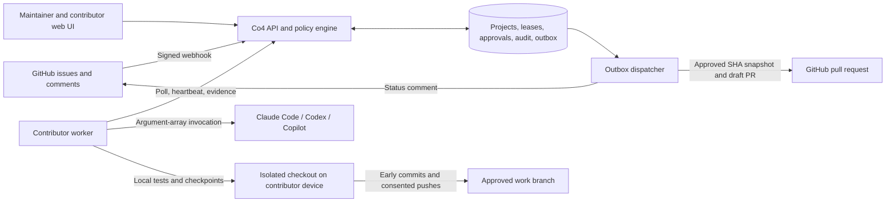

# Architecture

## Split control plane and execution plane

This is source text for the architecture diagram, not a separate compiled artifact. The web app is a static, same-origin client of the API. Contributors make outbound calls; the server does not require an inbound port on contributor devices. Harness authentication stays local. The GitHub App private key never goes to the worker.

## Domain records

`Project` binds a repository ID and installation ID to policy, owner, active state, and token quota. `Member` supplies a repository-scoped role, verification, and watching. `Device` belongs to a user and has a hashed, revocable bearer credential, selected harness, local participation preferences, and an allocation consent mode.

`Work` is the normalized issue record. Its monotonic generation and current lease pointer serialize ownership. `Lease` records the specific contributor/device attempt, phase, last contact, usage reservation, checkpoint, review digest, human approvals, recovery window, and delivery result. `Event` holds encrypted redacted server traces; `Audit` records governance decisions; `Delivery` deduplicates inbound GitHub webhook deliveries. `Outbox` durably records external status and publication intentions.

A handover creates a new lease and generation. It does not rewrite history to pretend that the second contributor produced the first contributor's evidence. The inherited checkpoint remains attached to work, and the fresh worker preserves it as a reference while rerunning the workflow against the current baseline.

## Transaction boundaries and fencing

Mutating operations start a database transaction and update a single mutex row. This deliberately serializes writers across API processes and avoids an in-memory lock masquerading as distributed coordination. It ensures two simultaneous pollers cannot both allocate the same request or reserve beyond the same available quota. SQLite uses WAL, foreign keys, and a busy timeout. The tests exercise concurrent requests against a file-backed SQLite database.

A worker call must match the device, current lease ID, current work generation, active project, eligible membership, allowed lease state, and enabled device. Old processes receive a conflict after reassignment. Remote GitHub calls occur outside writer transactions, followed by a second fence check where needed. This prevents database locks from being held during network waits, but it cannot turn a database transaction and a GitHub HTTP request into one atomic operation.

**Known limit:** the global writer is a throughput bottleneck, not a claim of elastic write scaling. PostgreSQL-compatible ORM configuration is included but not runtime-tested here. Before multiple replicas, bootstrap schema from one process and confirm migrations, locking, contention, and outbox recovery under PostgreSQL. Replace the global mutex with per-project / work locks and conditional claims after preserving the invariant tests. Add queue partitioning, quotas, pagination, and load testing; do not simply increase replicas and declare the problem solved.

## Outbound integration reliability

A status intention is coalesced per work item. A publish intention is keyed to the approved lease and SHA. Dispatchers claim records with an expiring lock token. Failures back off and become operator-visible after repeated attempts; triagers/maintainers can retry failed deliveries through the UI. Status comments are reconciled by a marker and the actual App bot login, not by an arbitrary user-authored lookalike comment.

PR publication creates an App-controlled upstream `co4/submission/<lease>/<sha-prefix>` branch at the approved SHA. A subsequent attempt reconciles the branch and existing PR before creating anything. The worker's changing `co4/work/...` branch is not the PR head. Branch or PR head drift is rejected or flagged. The App never merges.

A policy cancellation can race with an already in-flight GitHub create request. The dispatcher records the real created PR even if the local lease was cancelled and flags maintainer intervention. Strict immediate revocation of already dispatched external operations is not possible with this protocol. Repository rules and independent review remain necessary.

## Quotas and accounting

An allocation reserves the smaller of the project per-task ceiling and the device ceiling, provided the project has unaccounted quota. Only one attempt per user is active. Fully known reported input/output usage settles the reservation to its reported amount. Missing or partial usage settles conservatively to at least the reservation and any larger observed lower bound. An unaccepted offer consumes zero when released.

A token reservation is an internal allocation quota, not a provider-enforced dollar limit. A provider may report only at turn completion. Co4 stops at the next observed boundary but cannot promise zero overshoot inside an opaque invocation. Dollar values are included only when explicitly reported. Cached-token definitions differ across providers; normalization is documented in the adapter guide. The provider account still pays its provider directly.

## Information boundaries

The worker saves encrypted full locally observable prompts and output chunks. It posts redacted events to encrypted server storage. Server trace access is contributor-only. The public receipt is a separate allowlist of usage, timing, evidence references, and run/commit identifiers, not a redacted transcript dumped into a PR. The receipt is linkable to the PR and therefore is **de-identified aggregate metadata, not a guarantee of irreversible anonymity**.

The server's encryption key is needed for backups and recovery. Changing it without migration makes stored encrypted values unreadable. The device has its own encryption key. Filesystem permissions, disk encryption, backup encryption, and host isolation are still required. Built-in redaction catches common patterns but does not constitute a DLP system.

## API and deployment shape

The static client and API are served from one Python process. Production requires an HTTPS public URL and secure cookies. Webhook verification uses HMAC SHA-256 over the raw request body and constant-time comparison. Human actions use an authenticated session and same-origin CSRF protection; worker calls use a separate bearer credential. The server rejects bodies over 3 MB.

The alpha creates schema on startup; no safe automatic upgrade migration is claimed. Use a fresh database for this version, back up before upgrades, and add reviewed migrations before evolving a deployed schema. The health endpoint checks database access. There is no broker, Kubernetes requirement, inbound worker RPC, or separately hosted frontend build.

## Extension seams

`github.py` is the first tracker/delivery gateway. `adapters.py` defines command plans and normalizes exposed CLI events. `domain.py` owns allocation and approval, not tracker-specific HTTP. `outbox.py` owns side-effect delivery. New tracker and bounty gateways should consume versioned intention envelopes without receiving raw model credentials or bypassing approval. See [extensions](extensions.md).
